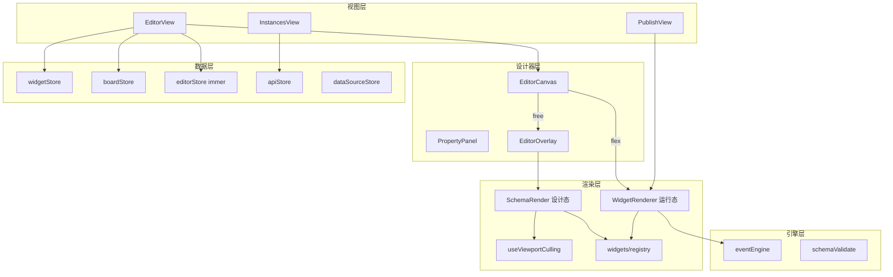

# Editor 架构文档

> `@editor` — Vue 3 可视化表单 / 页面 / 大屏编辑器  
> **文档版本**：v3（2026-07-20）— 对齐 E1 收口后代码（视口剔除、immer、注册式类型、大屏 Demo）

---

## 一、项目结构

```
editor/
├── src/
│   ├── views/               # 路由页面
│   ├── components/
│   │   ├── Editor/          # 设计器 UI
│   │   └── WidgetRenderer/  # 运行时 / 画布渲染
│   ├── widgets/             # 85 目录，91 registerWidget
│   ├── stores/              # 12 Pinia Store
│   ├── composables/         # 46 组合式 API
│   ├── engine/              # eventEngine
│   ├── api/                 # 11 领域 API
│   ├── utils/               # 模板、主题、Demo、坐标…
│   ├── locales/             # i18n 语言包
│   └── workers/             # IndexedDB / cache
├── docs/                    # 产品与架构文档
└── package.json             # @editor · 端口 5100
```

| 包 | 端口 | 依赖 |
|---|---|---|
| `@editor` | 5100 | `@schema-platform/platform-shared` |

---

## 二、分层架构



---

## 三、双路径渲染

| 路径 | 入口 | 布局 | 用途 |
|------|------|------|------|
| SchemaRender → SchemaNode | EditorCanvas（free） | 绝对定位 | 设计态画布 |
| WidgetRenderer → WidgetNode | EditorCanvas（flex）/ PublishView | 流式 | 预览 / 发布 / Flex 页 |

### 视口剔除（仅 free 编辑态）

1. `EditorView` 根据画布滚动容器计算 `ViewportRect`，`provide(VIEWPORT_CULLING_KEY)`
2. `SchemaRender` 对视口外 widget 渲染占位 div，视口内渲染 `SchemaNode`
3. **EditorOverlay 命中仍基于全量 widget 数据**，不依赖 DOM 是否挂载

---

## 四、Widget 系统

| 文件 | 职责 |
|------|------|
| `config.ts` | 元数据、propertyPanel、configPanels |
| `FgXxx.vue` | 运行时组件 |
| `index` / 工厂 | `createXxxWidget(id)` |
| `registry.ts` | `registerWidget` / `createWidgetPlugin` / `getComponentMap` |

- **`SchemaType = string`**（运行时真源为 registry；`KnownSchemaType` 仅文档/fallback）
- 分组：layout · form · container · table · action · static · business · chart
- 扩展：见 [third-party-widget-guide.md](./third-party-widget-guide.md)

---

## 五、Schema JSON

```typescript
{
  widgets: Widget[]
  board: {
    canvas: CanvasConfig  // layoutMode, themePreset, zoom, freeLayout…
    variables: BoardVariable[]
    events: BoardEvent[]
    pages?: BoardPage[]   // 多页（可选）
  }
}
```

大屏种子：`utils/dashboardDemo.ts` → `createBoardFromTemplate({ layoutMode: 'free', freePreset: 'dashboard-demo' })`

---

## 六、Pinia Store（12）

| Store | 职责 |
|-------|------|
| widget | Widget 树、reparent、布局适配 |
| editor | 选中、InteractionMode、immer 历史、剪贴板 |
| board | 画布、主题、变量、事件、多页 |
| drag | 拖拽、辅助线、碰撞预览 |
| api | Schema CRUD / 发布 |
| dataSource | 全局数据源定义 |
| app | 运行时 user/request/global |
| request | HTTP 缓存 |
| schemaVersion | 版本对比 |
| template | 模板 |
| credential | 凭证 |
| tenant | 租户 |

### 撤销重做

`editorStore` 使用 immer `enablePatches`：历史栈存 `patches` / `inversePatches`，加载 Schema 时 `resetHistory()`。

---

## 七、Composable 要点（46）

| 领域 | 代表 |
|------|------|
| 拖拽 / 缩放 | useDrag, useResize, useFlexCanvasDrop |
| 视口 / 对齐 | useViewportCulling, useWidgetAlignment |
| 联动 / 事件 | useLinkage, useChartEvents, useEventLog |
| 数据 | useDataSource, useDynamicOptions, useFormData |
| 布局 | useBoardLayout, useEditorLayout |
| 模式 | useModeControl, useInteractionControl |
| 历史 | useHistory（通用快照；主画布以 editorStore 为准） |

---

## 八、四大配置系统

| 系统 | 字段 | 说明 |
|------|------|------|
| 事件 | `events` | eventEngine 多动作 |
| 联动 | `linkages` | visible/disabled/required/options/set-value/reset-fields |
| API | `api` | 动态数据；可挂 dataSourceId |
| 变量 | `variables` | Widget / Board 变量 |

属性面板：`PropertyPanel` + `PropertyPanelSections` + `PropertyPanelConfigBar`。

---

## 九、交互模式

`INTERACTION_MODES`：`edit` | `preview` | `publish-interactive` | `publish-readonly`

- 设计器工具栏可切换
- PublishView：`?interaction=readonly|interactive`；可选 `showModeToggle=1`

---

## 十、观测与 i18n

| 模块 | 位置 | 说明 |
|------|------|------|
| telemetry | platform-shared | `track` / `reportError`；缺 server 时缓冲 localStorage |
| i18n | platform-shared `createI18n` | editor `locales/editor-*.ts`；渐进接入 UI |

---

## 十一、统计基准（2026-07-20）

| 指标 | 数量 |
|------|------|
| Store | 12 |
| Composable | 46 |
| Widget 目录 | 85 |
| registerWidget | 91 |
| Vitest 规格 | 99 |
| API | 11 |

---

## 相关文档

- [能力总览](./capabilities.md)
- [文档索引](./README.md)
- [产品收口](./iteration-evolution.md)
- 根 [README](../README.md)
