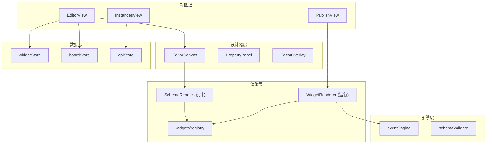

# Editor 架构文档

> `@editor` — Vue 3 可视化表单设计器

**文档版本**：v2 (2026-07-06) — 对齐当前代码，新增设计/运行时文档

---

## 一、项目结构

```
editor/
├── src/
│   ├── views/              # 路由页面（列表、设计器、发布）
│   ├── components/
│   │   ├── Editor/         # 设计器 UI（~70 文件）
│   │   └── WidgetRenderer/ # 运行时渲染引擎
│   ├── widgets/            # ~80 种 Widget 注册
│   ├── stores/             # 11 个 Pinia Store
│   ├── composables/        # 44 个组合式 API
│   ├── engine/             # eventEngine 纯逻辑
│   ├── api/                # 领域 API 聚合
│   └── utils/              # apiClient、校验、解析
└── docs/
```

| 包 | NPM | 端口 |
|---|---|---|
| `@editor` | `editor/package.json` | 5100 |

**依赖**：`@schema-platform/platform-shared`

---

## 二、分层架构



---

## 三、Widget 系统

每个 Widget 目录通常包含：

| 文件 | 职责 |
|------|------|
| `config.ts` | 元数据、propertyPanel、事件/联动配置 |
| `schema.ts` | `createXxxWidget(id)` 工厂 |
| `FgXxx.vue` | 运行时组件 |
| `mock.ts` | 设计器示例数据（可选） |

注册：`widgets/index.ts` → `registerWidget()` → `getComponentMap()`

分组：layout、form、container、table、action、static、business、chart

---

## 四、Schema JSON

```typescript
{
  widgets: Widget[],
  board: {
    canvas: { width, height, layoutMode: 'free'|'flex', zoom },
    variables: BoardVariable[],
    events: BoardEvent[],
  }
}
```

解析：`utils/parseSchemaJson.ts`（兼容旧数组格式）

---

## 五、三运行表面

| 表面 | 路由 | 渲染 | 数据 API |
|------|------|------|----------|
| 设计器 | `/editor` | SchemaRender + Overlay | 草稿 |
| 草稿预览 | `/preview` | WidgetRenderer | 草稿 |
| 已发布 | `/view/:code` | WidgetRenderer | 已发布 |

---

## 六、Pinia Store（11 个）

| Store | 职责 |
|-------|------|
| `widgetStore` | Widget 树 CRUD（数据真源） |
| `editorStore` | 选中、undo/redo、dirty、模式 |
| `boardStore` | 实例元数据、画布、变量、事件 |
| `dragStore` | 拖拽、吸附 |
| `apiStore` | Schema CRUD、保存、发布 |
| `schemaVersionStore` | 版本列表、对比 |
| `templateStore` | 部件模板库 |
| `appStore` | 用户/请求上下文 |
| `requestStore` | 请求缓存 |
| `tenantStore` / `credentialStore` | 管理 |

> 旧文档「7 Store」已过时，以本表为准。

---

## 七、集成

| 消费方 | 方式 |
|--------|------|
| Shell | qiankun 子应用 `editor` |
| Flow | iframe PublishView + postMessage |
| AI | WebSocket `onAiApply` |

---

## 八、文档索引

### 架构与开发

- [Widget 开发](./widget-development.md)
- [属性面板](./property-panel.md)
- [Schema 校验](./schema-validation-testing.md)
- [qiankun 集成](./qiankun-integration.md)

### 设计与运行时（含线框图、Mermaid 图）

- [设计文档索引](./design/README.md)
- [信息架构](./design/overview.md)
- [设计器交互](./design/designer.md)
- [实例与发布](./design/instances-publish.md)
- [**运行时架构**](./design/runtime.md)
