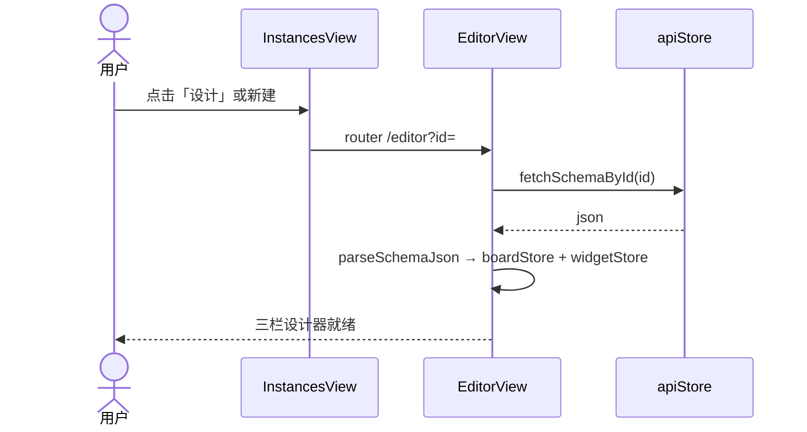
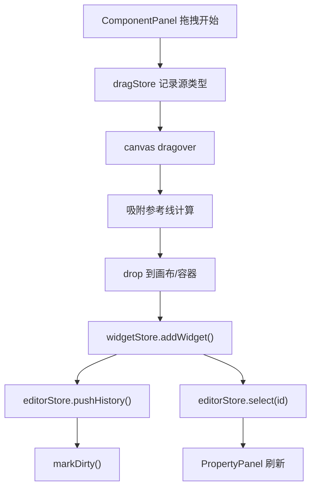
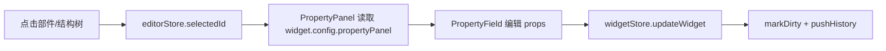
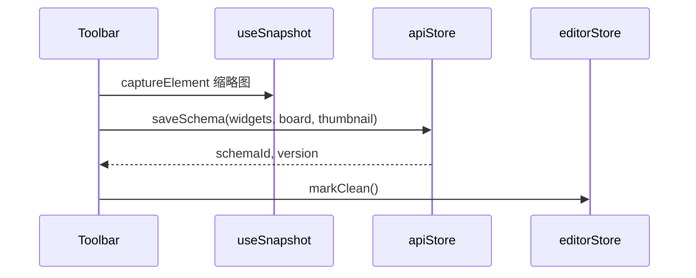
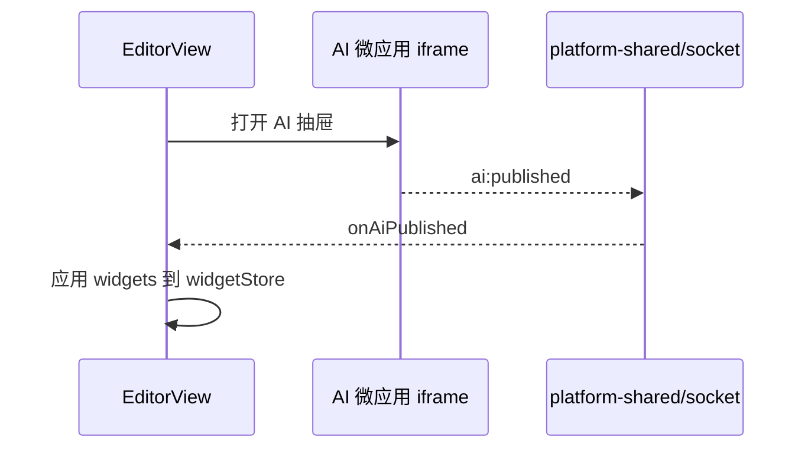

# Editor 设计器 — 设计稿与交互流

## 一、线框（EditorView）

```
┌──────────────────────────────────────────────────────────────────────────┐
│ EditorViewToolbar                                                        │
│ [保存] [发布] [撤销/重做] [缩放] [校验▾] [预览] [AI]        名称: [___]   │
├──────────┬───────────────────────────────────────────────┬───────────────┤
│ LeftPanel│ Canvas                                        │ PropertyPanel │
│ 240px    │                                               │ 320px         │
│          │  ┌─ EditorRuler ─────────────────────────┐   │               │
│ [部件库] │  │ EditorCanvas                          │   │ ▼ 基础属性    │
│ [结构树] │  │  SchemaRender + EditorOverlay         │   │   label/field │
│ [模板]   │  │  (选中框/拖拽/resize/右键菜单)           │   │ ▼ 样式        │
│          │  └───────────────────────────────────────┘   │ ▼ 事件/联动   │
│          │  ZoomIndicator | EventLogDrawer              │ ▼ 规则/API    │
│          │  [可选 AI iframe 抽屉]                       │               │
└──────────┴───────────────────────────────────────────────┴───────────────┘
```

---

## 二、核心交互流

### 2.1 从列表进入设计



### 2.2 拖拽添加部件



### 2.3 选中与属性编辑



`visibleOn` 表达式控制属性字段显隐。

### 2.4 撤销/重做

```
editorStore.history[] 存储 widget 快照
  undo → 恢复 history[index-1] → widgetStore.widgets =
  redo → 相反
```

### 2.5 保存



自动保存：`useAutoSave` 脏标记后 60s 防抖。

### 2.6 校验（非阻塞）

```
工具栏「校验」→ useSchemaValidation.runValidation()
  → schemaValidate.ts 静态规则 + 引用完整性
  → 结果 Popover 展示（不阻止保存）
```

### 2.7 预览模式

```
Toolbar「预览」→ editorStore.mode = 'preview'
  → EditorOverlay 隐藏编辑手柄
  → 部件按 runtime 行为渲染（仍用 editor surface）
```

---

## 三、画布布局模式

| 模式 | `board.canvas.layoutMode` | 行为 |
|------|---------------------------|------|
| 自由布局 | `free` | 绝对定位；EditorOverlay 拖拽 / resize / 辅助线（见 §2.2） |
| 弹性布局 | `flex` | 流式 WidgetRenderer；`useFlexCanvasDrop` + 列区 `FlexColDropZone` |

### 3.1 Flex 编辑交互（2026-07-22 核实更新）

已实现（原「缺口」均已落地）：
- 根级投放 + Y 插入索引（`useFlexCanvasDrop`）+ 插入指示线（`renderFlexInsertIndicator`，蓝色前后指示线）
- 容器内投放（`useFlexDropZone`）：form/card/tabs/row-container 等接收子节点，tabs/col 过滤索引映射回全量（`mapFilteredIndexToFull`）
- 拖拽重排：已有部件拖动换位（`source: 'canvas'` -> `moveWidgetToIndex`）
- Flex resize：WidgetNode 右边缘 6px resize handle，拖拽改 `style.width`（px）
- `span` 24 栅格：row-container 子节点按 `span`（1-24）分配 `flex-basis`，PropertyPanel Flex section 可配
- 容器嵌套 max 2 层（`MAX_CONTAINER_DEPTH`，对齐 [container-nesting-decision.md](../container-nesting-decision.md)）
- 右键菜单（`WidgetContextMenu`，flex 独立实例）：复制/复制ID/置顶/置底/锁定/隐藏/删除 + 打开事件/联动/API/变量配置
- 选中框（`editorShellSelected` 蓝色 outline）+ hover outline + hidden 半透明虚线
- 多选（shift+click `toggleSelect`）+ 批量删除
- 键盘快捷键（不 gate 模式）：Delete/Backspace 删除、Ctrl+C/V 复制粘贴、Ctrl+Z/Y 撤销重做、Ctrl+Alt+L/H 锁定隐藏、**Ctrl+↑/↓ 同级前移/后移**（flex 流式重排，`editorStore.performMoveSelected`）
- 画布 zoom（`transform: scale`）
- ComponentPanel 按 `availableIn`/`contexts` 过滤 flex 可用部件

仅 free 专属（flex 无意义，已正确隔离）：绝对坐标对齐/分布（Alt+Shift+L/R/C/H/V）、EditorOverlay 8 向 resize、网格吸附、EditorRuler、画布 px 宽高配置。

诚实判定：Flex 已是与 free 对等的**完整流式设计器**，覆盖拖入/重排/resize/栅格/嵌套/右键/快捷键/多选/缩放。剩余差异是布局模型本身决定的（流式 vs 绝对），非功能缺口。

---

## 四、配置对话框

从 PropertyPanel 打开的独立对话框：

| 对话框 | 配置 |
|--------|------|
| EventConfigDialog | 部件事件 → 动作链 |
| LinkageSchemaDialog | 字段联动 |
| OptionsApiConfigDialog | 选项数据源 API |
| VariableConfigDialog | 页面变量 |
| RulesEditor | 校验规则 |

---

## 五、AI 集成



---

## 六、离开守卫

```
router beforeEach: /editor 离开 && isDirty
  → ElMessageBox 确认
  → 取消则 abort navigation
```
