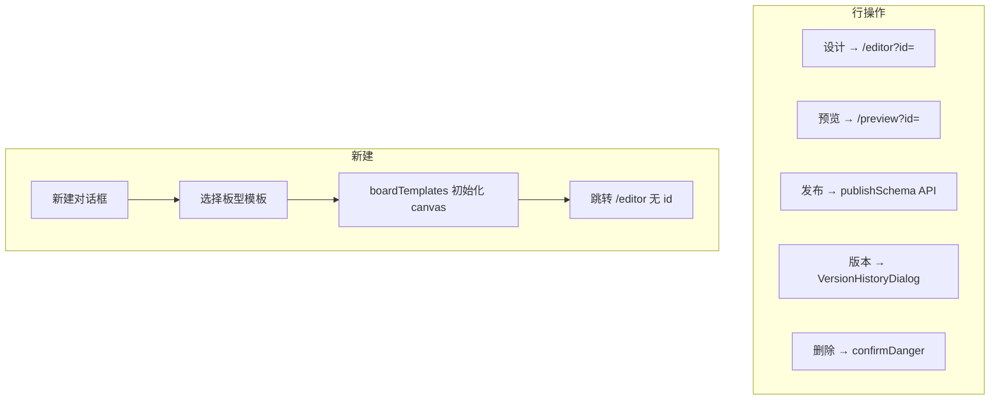
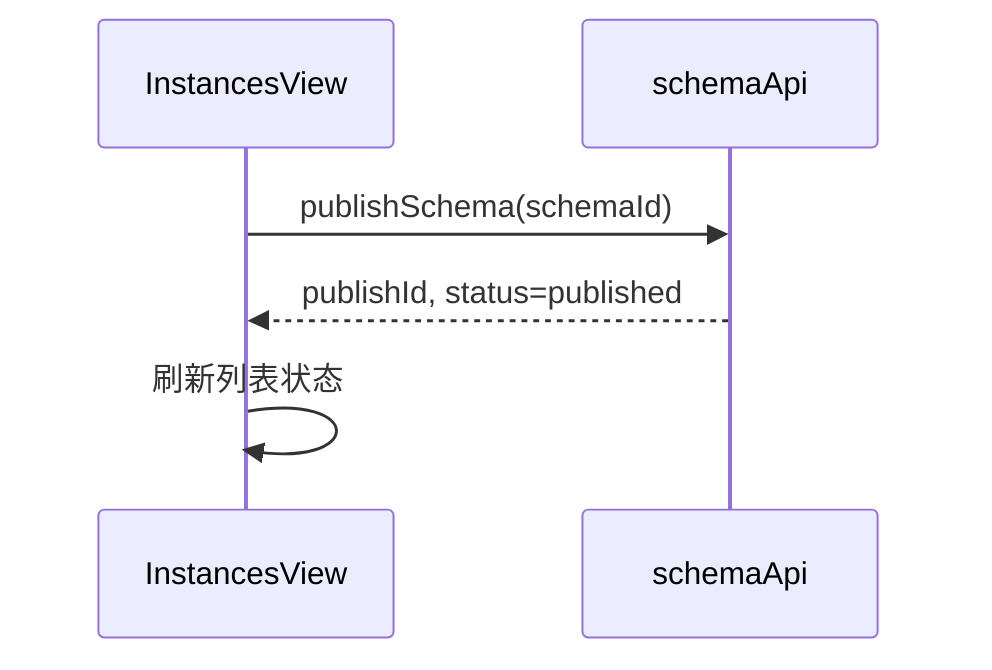
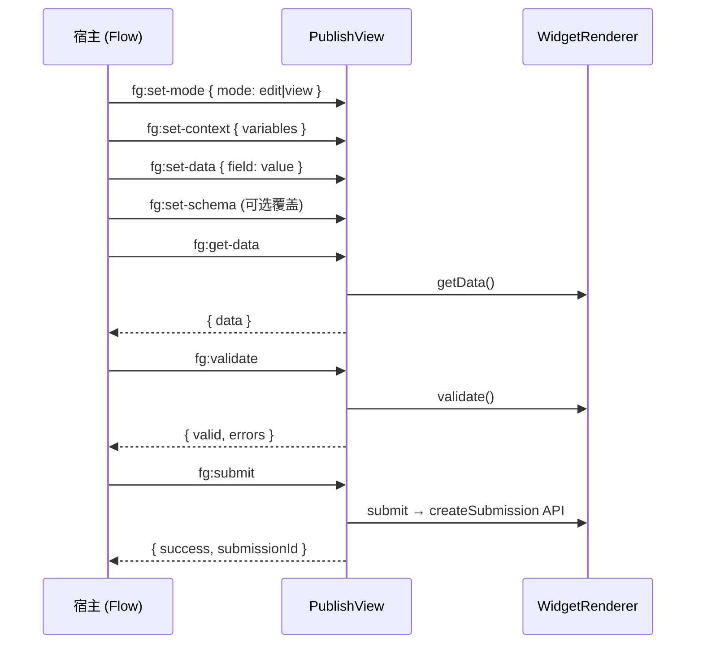
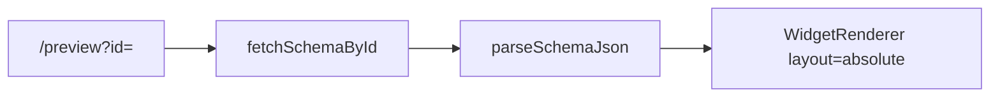
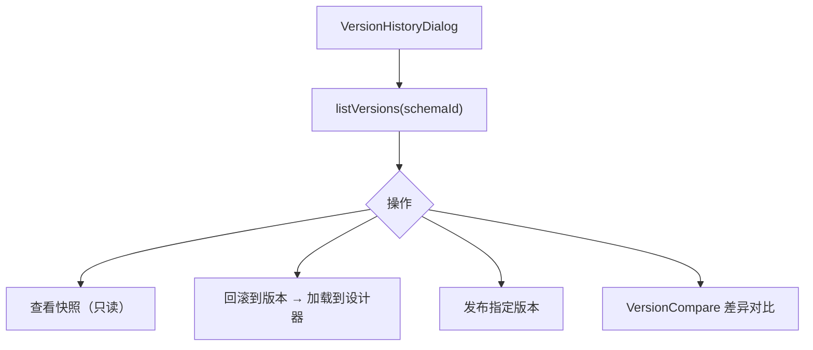
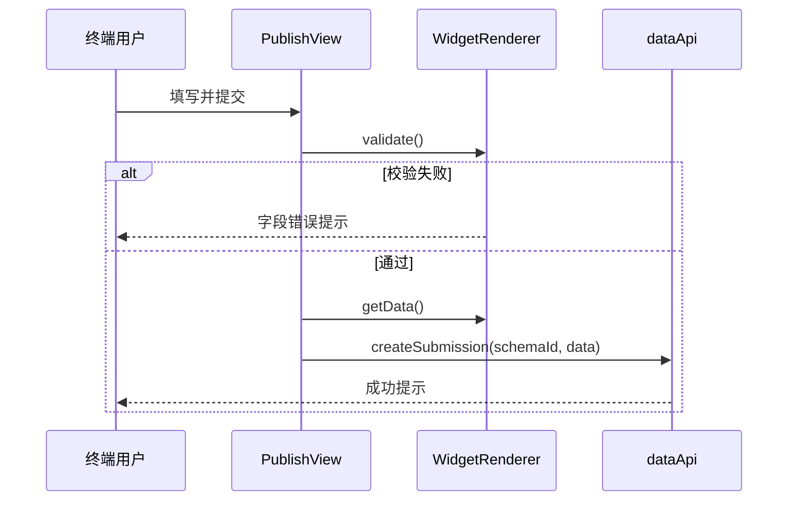

# Editor 实例与发布 — 设计稿与交互流

## 一、实例列表线框（InstancesView）

```
┌──────────────────────────────────────────────────────────────────────────┐
│ 表单实例                              [+ 新建] [导入] [导出]              │
├──────────────────────────────────────────────────────────────────────────┤
│ 🔍 搜索...     筛选: [全部▾] [草稿] [已发布]                             │
├──────────────────────────────────────────────────────────────────────────┤
│  名称          状态      更新时间        操作                             │
│  用户注册表单   已发布    2小时前    [设计] [预览] [发布] [版本] [删除]    │
│  请假申请       草稿      昨天       [设计] [预览] [发布] ...             │
└──────────────────────────────────────────────────────────────────────────┘
```

---

## 二、列表操作交互流



### 发布（从列表）



---

## 三、发布运行时线框（PublishView）

```
┌──────────────────────────────────────────────────────────────────────────┐
│ [可选顶栏] 表单标题                                    mode: edit/view    │
├──────────────────────────────────────────────────────────────────────────┤
│                                                                          │
│                    WidgetRenderer (runtime surface)                      │
│                    表单字段渲染 + 联动 + 校验                              │
│                                                                          │
├──────────────────────────────────────────────────────────────────────────┤
│ [提交] [重置]                                                            │
└──────────────────────────────────────────────────────────────────────────┘
```

### 访问方式

| URL | 加载 API |
|-----|----------|
| `/view/:schemaCode` | `fetchPublishedByCode` |
| `/view?id=publishId` | `fetchPublishedByPublishId` |

---

## 四、postMessage 嵌入协议

外部宿主（Flow UserTask、微前端容器）通过 iframe 嵌入 PublishView：



| 消息 | 方向 | 说明 |
|------|------|------|
| `fg:set-mode` | Host → Editor | 编辑/只读/部分可编辑 |
| `fg:set-context` | Host → Editor | 注入流程变量 |
| `fg:set-data` | Host → Editor | 预填表单数据 |
| `fg:get-data` | Host → Editor | 读取当前表单值 |
| `fg:validate` | Host → Editor | 触发字段校验 |
| `fg:submit` | Host → Editor | 提交到 server |
| `fg:reset` | Host → Editor | 重置表单 |

实现：`editor/src/microapp/bridge.ts` + `PublishView.vue`。

---

## 五、草稿预览（PreviewRenderView）



与 PublishView 差异：加载**草稿** API，无提交发布约束。

---

## 六、版本管理



查询参数 `?editId=&version=` 可直接打开历史版本编辑。

---

## 七、提交流程（运行时）



可选：事件引擎 `submit` 动作触发 `startFlow` 启动关联流程。
