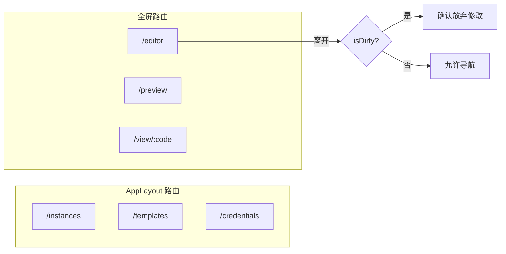
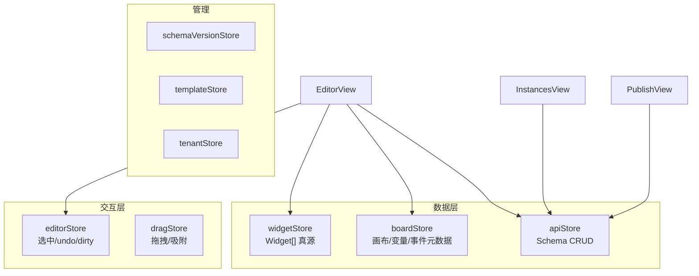
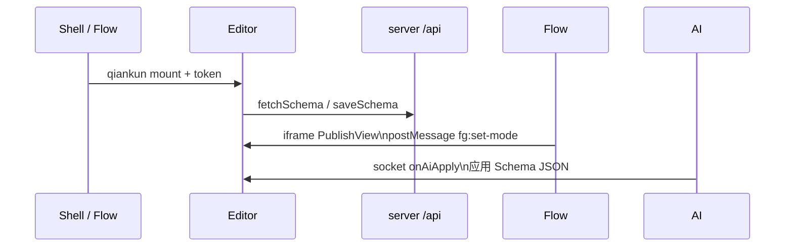

# Editor 信息架构与布局

## 一、应用壳层

### 1.1 独立模式

```
┌──────────────────────────────────────────────────────────────────────────┐
│ AppLayout                                                                │
├────────────┬─────────────────────────────────────────────────────────────┤
│ 侧栏       │  主内容区                                                    │
│            │                                                             │
│ 表单实例   │                                                             │
│ 部件模板   │                                                             │
│ API 凭证   │                                                             │
│ 租户管理   │                                                             │
│ 提交记录   │                                                             │
│ 部件文档   │                                                             │
└────────────┴─────────────────────────────────────────────────────────────┘
```

### 1.2 全屏页面（无侧栏）

| 路由 | 视图 | 用途 |
|------|------|------|
| `/editor?id=` | `EditorView` | 可视化设计器 |
| `/preview?id=` | `PreviewRenderView` | 草稿预览 |
| `/view/:schemaCode` | `PublishView` | 已发布运行时 |

### 1.3 qiankun 嵌入

- 子应用名：`editor`，开发端口 **5100**
- 嵌入时 `useQiankunShell().shouldHideSubAppMenu` 隐藏侧栏
- Shell 注入 `getToken`、`getRouteBase`
- 独立访问 fallback：500ms 内未 mount 则自启动

---

## 二、路由与守卫



**Editor 查询参数**：

| 参数 | 说明 |
|------|------|
| `id` | Schema 草稿 ID |
| `editId` + `version` | 打开历史版本 |

---

## 三、Store 关系



**实际 11 个 Pinia Store**（详见 [runtime.md](./runtime.md)）。

---

## 四、与平台集成



| 集成方 | 方式 |
|--------|------|
| Shell | qiankun 微前端 |
| Flow | UserTask 嵌入 `/view/:publishId` |
| AI | WebSocket 应用生成结果 |
| 外部宿主 | PublishView postMessage 协议 |

---

## 五、三表面运行时对比

| 表面 | 路由 | 数据 | 渲染器 |
|------|------|------|--------|
| 设计器 | `/editor` | 草稿（内存+API） | EditorCanvas → SchemaRender |
| 草稿预览 | `/preview` | `fetchSchemaById` | WidgetRenderer |
| 已发布 | `/view/:code` | `fetchPublishedByCode` | WidgetRenderer + 提交 |

详见 [instances-publish.md](./instances-publish.md)、[runtime.md](./runtime.md)。
