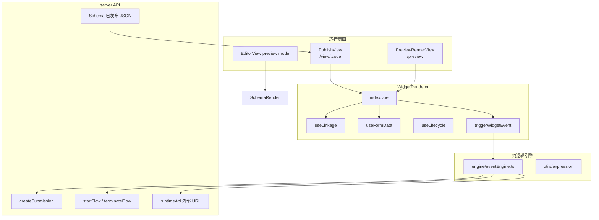
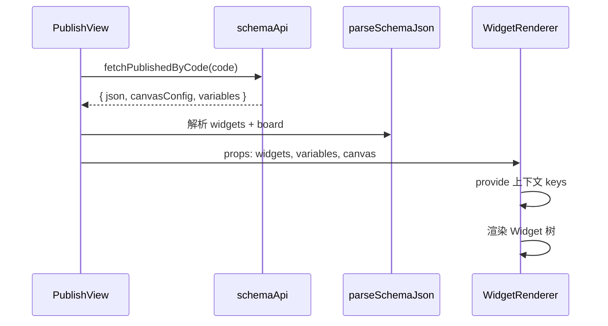
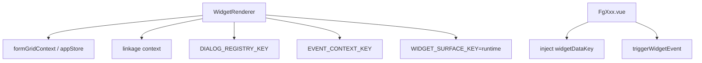
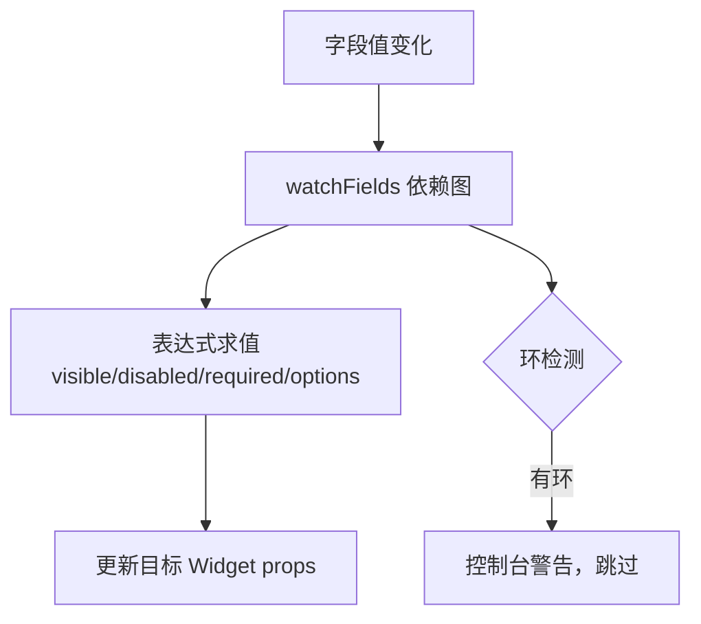
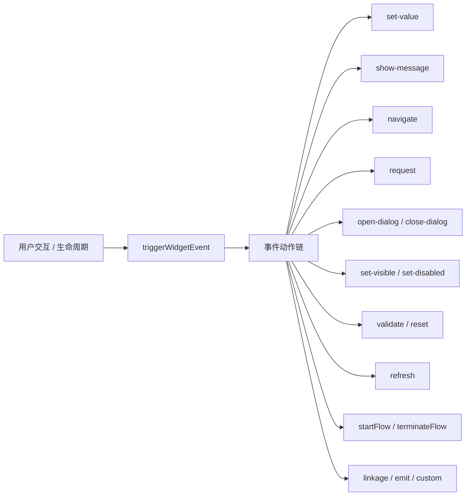
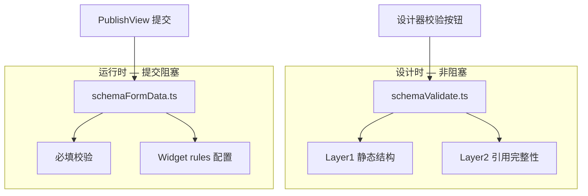
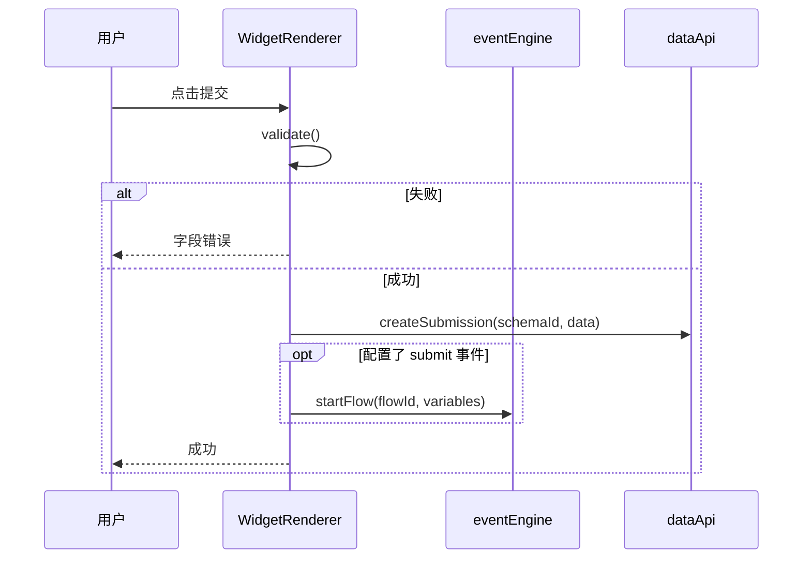
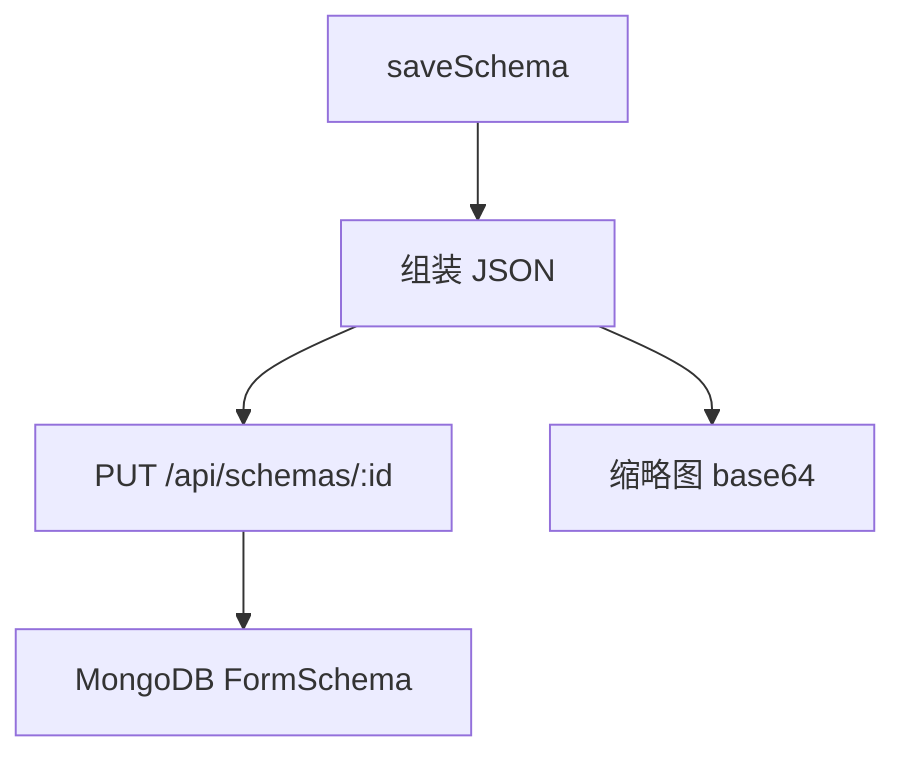

# Editor 运行时架构

> WidgetRenderer、事件引擎、联动、校验 — 设计时 vs 运行时的执行路径

---

## 一、运行时总览



---

## 二、Surface 契约

| Surface | `WIDGET_SURFACE_KEY` | Mock 数据 | 用途 |
|---------|---------------------|-----------|------|
| 设计器画布 | `'editor'` | ✅ `mock.ts` | 拖拽编排 |
| 运行时 | `'runtime'` | ❌ | 真实用户填表 |

Widget 组件通过 `inject(widgetDataKey)` 获取数据，**禁止**直接读 Pinia Store。

---

## 三、Schema 加载运行时



### Schema JSON 格式

```typescript
{
  widgets: Widget[],           // 部件树
  board: {
    canvas: { width, height, layoutMode, zoom, ... },
    variables: BoardVariable[],
    events: BoardEvent[],      // 页面级事件
  }
}
```

`parseSchemaJson` 兼容旧格式（纯 `Widget[]` 数组）。

---

## 四、WidgetRenderer 运行时

### 4.1 Provide / Inject 键



### 4.2 暴露 API（供 PublishView / postMessage）

| 方法 | 说明 |
|------|------|
| `getData()` | 收集所有字段值 |
| `setData(data)` | 批量赋值 |
| `validate()` | 字段级校验 |
| `submit()` | 校验 + 提交 |
| `reset()` | 重置表单 |

---

## 五、联动运行时（useLinkage）



联动配置来自 Widget `config.linkage` 或 LinkageSchemaDialog。

---

## 六、事件引擎运行时

`engine/eventEngine.ts` — **纯函数**，无 Vue 依赖。



### EventExecutionContext 注入

```typescript
{
  getFormData, setFormData,
  getVariable, setVariable,
  apiClient, navigate,
  openDialog, closeDialog,
  showMessage, ...
}
```

---

## 七、校验运行时（两层）



---

## 八、提交流运行时



---

## 九、保存运行时（设计器）



自动保存：`useAutoSave` 监听 `editorStore.isDirty`，60s debounce。

---

## 十、API 运行时路径

```
Widget/Store/Composable
        ↓
src/api/*.ts
        ↓
utils/apiClient.ts (Bearer token, retry, mock)
        ↓
server /api/*
```

| 运行时场景 | API 模块 |
|------------|----------|
| 表单提交 | `dataApi.createSubmission` |
| 字典/选项 | `widgetApi` |
| 外部 URL | `runtimeApi.fetchRuntimeUrl` |
| 流程触发 | `dataApi.startFlow` |
| 审批日志 | `flowApi` |

---

## 十一、Pinia Store 运行时参与

| Store | 设计时 | 运行时 (PublishView) |
|-------|--------|---------------------|
| widgetStore | ✅ | ❌（props 传入） |
| boardStore | ✅ | ❌ |
| editorStore | ✅ | ❌ |
| appStore | 部分 | ✅ formGridContext |
| apiStore | ✅ 持久化 | ✅ 加载已发布 |

---

## 十二、约束速查

| 约束 | 说明 |
|------|------|
| Widget 不读 Store | 运行时通过 inject |
| 已发布只读 API | PublishView 不用草稿 API |
| 事件引擎纯函数 | 可单测，context 注入 |
| apiClient 统一出口 | 禁止组件直接 fetch |

---

## 相关文档

- [designer.md](./designer.md) — 设计器 UI 交互
- [instances-publish.md](./instances-publish.md) — 发布与嵌入
- [../architecture.md](../architecture.md) — 组件架构
- [../widget-development.md](../widget-development.md) — Widget 开发
